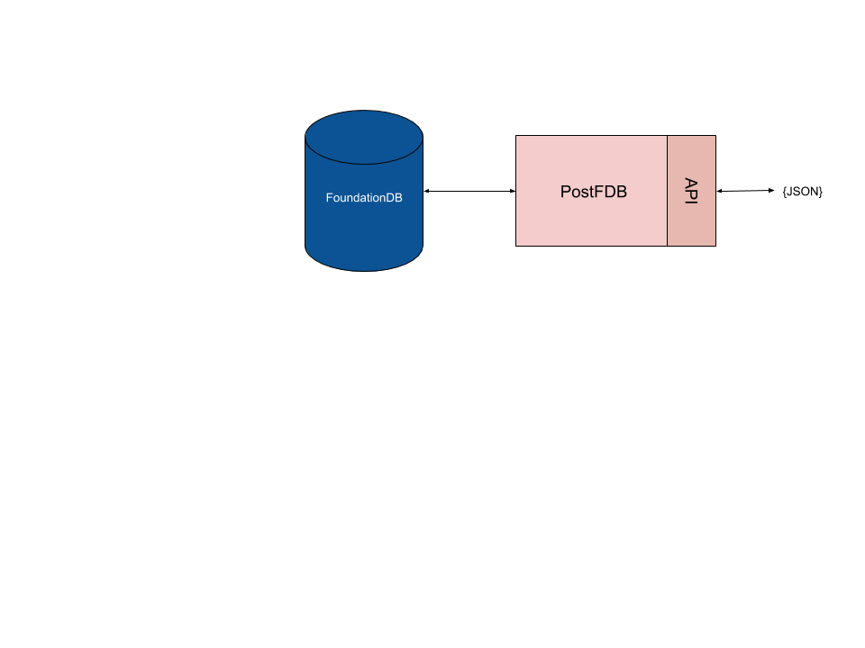

# PostFDB

*PostFDB* is proof-of-concept database that exposes a Apache CouchDB-like API but which is backed by a FoundationDB database. It supports:

- Create/Delete database API
- Insert/Update/Delete document API, without requiring revision tokens.
- Bulk Insert/Update/Delete API.
- Fetch all documents or a range using the primary index.
- Fetch documents by key or range of keys using secondary indexes.
- "Pull" replication i.e. fetching data from a remote URL.

It does not implement CouchDB's MVCC, Design Documents, attachments, MapReduce, "Mango" search or any other CouchDB feature.

It does however provide a "consistent" data store where the documents and secondary indexes are in lock-step. Documents are limited to 100KB in size.



## Running locally

Download this project and install the dependencies to run it on your machine:

```sh
npm install
npm run start
```

The application will connect to local [FoundationDB](https://www.foundationdb.org/) instance and start serving out its API on port 5984 (CouchDB's default port), by default.

## API Reference

### Ping the service - GET /

```sh
$ curl -X GET http://localhost:5984/
{"postFDB":"Welcome","pkg":"postfdb","node":"v12.8.1","version":"1.0.0"}
```

### Get list of databases - GET /_all_dbs

```sh
$ curl -X GET http://localhost:5984/_all_dbs
["_replicator","animaldb","cities"]
```

### Create Database - PUT /db

```sh
$ curl -X PUT http://localhost:5984/mydb
{"ok":true}
```

### Get Database Info  - GET /db

```sh
$ curl -X GET http://localhost:5984/mydb
{"update_seq":"47036","db_name":"mydb","purge_seq":0,"doc_del_count":0,"doc_count":0}
```

### Add a document (known ID) - PUT /db/id

```sh
$ curl -X PUT \
       -H 'Content-type: application/json' \
       -d '{"x": 1, "y": false, "z": "aardvark"}' \
       http://localhost:5984/mydb/a
{"ok":true,"id":"a","rev":"0-1"}
```

### Add a document (generated ID) - POST /db

```sh
$ curl -X POST \
       -H 'Content-type: application/json' \
       -d '{"x": 2, "y": true, "z": "bear"}' \
       http://localhost:5984/mydb
{"ok":true,"id":"001hla5z2pEedb3wB5rI2Rkd0k2pzUQg","rev":"0-1"}
```

### Get a document by id - GET /db/id

```sh
$ curl -X GET http://localhost:5984/mydb/a
{"x":1,"y":false,"z":"aardvark","_id":"a","_rev":"0-1","_i1":"","_i2":"","_i3":""}
```

### Get all documents - GET /db/_all_docs

```sh
$ curl -X GET http://localhost:5984/mydb/_all_docs
{"rows":[{"id":"a","key":"a","value":{"rev":"0-1"}},{"id":"001hla5z2pEedb3wB5rI2Rkd0k2pzUQg","key":"001hla5z2pEedb3wB5rI2Rkd0k2pzUQg","value":{"rev":"0-1"}},{"id":"b","key":"b","value":{"rev":"0-1"}},{"id":"c","key":"c","value":{"rev":"0-1"}},{"id":"d","key":"d","value":{"rev":"0-1"}},{"id":"e","key":"e","value":{"rev":"0-1"}},{"id":"f","key":"f","value":{"rev":"0-1"}}]}
```

Add `include_docs=true` to include document bodies:

```sh
$ curl -X GET http://localhost:5984/mydb/_all_docs?include_docs=true
{"rows":[{"id":"a","key":"a","value":{"rev":"0-1"},"doc":{"x":1,"y":false,"z":"aardvark","_id":"a","_rev":"0-1","_i1":"","_i2":"","_i3":""}},{"id":"001hla5z2pEedb3wB5rI2Rkd0k2pzUQg","key":"001hla5z2pEedb3wB5rI2Rkd0k2pzUQg","value":{"rev":"0-1"},"doc":{"x":2,"y":true,"z":"bear","_id":"001hla5z2pEedb3wB5rI2Rkd0k2pzUQg","_rev":"0-1","_i1":"","_i2":"","_i3":""}},{"id":"b","key":"b","value":{"rev":"0-1"},"doc":{"x":1,"y":false,"z":"bat","_id":"b","_rev":"0-1","_i1":"","_i2":"","_i3":""}},{"id":"c","key":"c","value":{"rev":"0-1"},"doc":{"x":1,"y":false,"z":"cat","_id":"c","_rev":"0-1","_i1":"","_i2":"","_i3":""}},{"id":"d","key":"d","value":{"rev":"0-1"},"doc":{"x":1,"y":false,"z":"dog","_id":"d","_rev":"0-1","_i1":"","_i2":"","_i3":""}},{"id":"e","key":"e","value":{"rev":"0-1"},"doc":{"x":1,"y":false,"z":"eagle","_id":"e","_rev":"0-1","_i1":"","_i2":"","_i3":""}},{"id":"f","key":"f","value":{"rev":"0-1"},"doc":{"x":1,"y":false,"z":"fox","_id":"f","_rev":"0-1","_i1":"","_i2":"","_i3":""}}]}
```

Add a `limit` parameter to reduce number of rows returned:

```sh
$ curl -X GET http://localhost:5984/mydb/_all_docs?limit=2
{"rows":[{"id":"a","key":"a","value":{"rev":"0-1"}},{"id":"001hla5z2pEedb3wB5rI2Rkd0k2pzUQg","key":"001hla5z2pEedb3wB5rI2Rkd0k2pzUQg","value":{"rev":"0-1"}}]}
```

Use `startkey`/`endkey` to fetch a range of document ids:

```sh
$ curl -X GET 'http://localhost:5984/mydb/_all_docs?startkey="b"&endkey="d"'
{"rows":[{"id":"b","key":"b","value":{"rev":"0-1"}},{"id":"c","key":"c","value":{"rev":"0-1"}},{"id":"d","key":"d","value":{"rev":"0-1"}}]}
```

Parameters:

- `startkey`/`endkey` - one or both supplied, for range queries.
- `limit` - the number of documents to return   (default: 100)

### Get changes feed - GET /db/_changes

```sh
$ curl -X GET http://localhost:5984/mydb/_changes_
{"last_seq":"001hluy4","results":[{"changes":[{"rev":"0-1"}],"id":"001hluy43gHHub3XakCv0Mt4DL0LpMRr","seq":"001hluy4"},{"changes":[{"rev":"0-1"}],"id":"001hluy41gCxKV2lM6oV1eaRTp2apBWS","seq":"001hluy4"}}
```

Parameters:

- `since` - return changes after a known point. Default `0`
- `include_docs` - if `true` returns document body too. Default `false`
- `limit` - the number of documents to return.

### Bulk operations - POST /db/_bulk_docs

```sh
$ curl -X POST \
       -H 'Content-type: application/json' \
       -d '{"docs":[{"x": 2, "y": true, "z": "bear"},{"_id":"abc","_deleted":true}]}' \
       http://localhost:5984/mydb/_bulk_docs
[{"ok":true,"id":"001hlstC1aW4vf189ZLf2xZ9Rq4LriwV","rev":"0-1"},{"ok":true,"id":"abc","rev":"0-1"}]
```

### Delete a document - DELETE /db/id

```sh
$ curl -X DELETE http://localhost:5984/mydb/001hla5z2pEedb3wB5rI2Rkd0k2pzUQg
{"ok":true,"id":"001hla5z2pEedb3wB5rI2Rkd0k2pzUQg","rev":"0-1"}
```

### Delete a database - DELETE /db

```sh
$ curl -X DELETE http://localhost:5984/mydb
{"ok":true}
```

## Indexing

*PostFDB* has no MapReduce, or Mango search but it does allow any number of fields to be indexed. By default, those are fields starting with `_` (except `_id`, `_rev` and `_deleted`) e.g. `_i1`, `_myindex` & `_sausages`. For example your document could look like this:

```js
{
  "_id": "abc123",
  "_i1": "1561972800000",
  "_i2": "smith",
  "_i3": "person:uk:2019-07-01",
  "type": "person",
  "name": "Bob Smith",
  "dob": "1965-04-21",
  "country": "uk",
  "lastLogin": "2019-07-01 10:20:00"
}
```

In this case `_i1` is used to extract users by a timestamp, perhaps last login time. The `_i2` index is used to extract users by surname, all lowercase. The third compounds several fields: document type, country and last login date.

If documents don't need additional data indexed, then the fields can be omitted or left as empty strings. All the indexed fields must be strings.

The indexed data can be accessed using the `POST /db/_query` endpoint which expects a JSON object that defines the query like so:

```js
{ 
  "index": "i1",
  "startkey": "c",
  "endkey": "m"
}
``` 

e.g

```sh
```sh
$ curl -X POST \
       -H 'Content-type: application/json' \
       -d '{"index": "i1", "startkey": "e", "endkey": "m"}' \
       http://localhost:5984/mydb/_query
{"docs":[...]}
```

Parameters:

- `index` - the name of index to query (mandatory).
- `startkey`/`endkey` - one or both supplied, for range queries.
- `key` - the key in the index to search for, for selection queries.
- `limit` - the number of documents to return   (default: 100)

## Replication

Only "pull" replication is supported i.e. fetching data from a remote URL. A replication is started by writing a data to the `_replicator` database:

```sh
$ curl -X POST \
      -d '{"source":"https://U:P@host.cloudant.com/cities","target":"cities"}' \
      http://localhost:5984/_replicator
{"ok":true,"id":"73106768769860315949fe301a75c18a","rev":"0-1"}
```

Parameters for a _replicator document:

- `source` - the source database (must be a URL)
- `target` - the target databasr (must be a local database name)
- `since` - the sequence token to start replication from (default `0`)
- `continuous` - if true, replicates from the source forever (default `false`)
- `create_target` - if true, a new target database is created (default `false`)

Replications are processed by a second process which is run with:

```sh
$ npm run replicator
```

Only one such process should run. It polls for new replcation jobs and sets them off. It will
resume interrupted replications on restart.

You can check on the status of a replication by pulling the `_replicator` document you created:

```sh
$ curl http://localhost:5984/_replicator/73106768769860315949fe301a75c18a
{
  "source": "https://U:P@host.cloudant.com/cities",
  "target": "cities",
  "continuous": false,
  "create_target": false,
  "state": "running",
  "seq": "5000-g1AAAAf7eJy9lM9NwzAUh",
  "doc_count": 5000,
  "_id": "73106768769860315949fe301a75c18a",
  "_rev": "0-1",
  "_i1": "running",
  "_i2": "",
  "_i3": ""
}
```

Note the additional fields:

- `state` - the state of the replication `new`/`running`/`completed`/`error`
- `doc_count` - the number of documents written so far.

## Dashboard

This project doesn't come with a dashboard but you can run *PostFDB* and Apache CouchDB's [Fauxton](https://github.com/apache/couchdb-fauxton) dashboard alongside:

```sh
npm install -g fauxton
fauxton
```

The dashboard works for most things except Mango search.

## Configuring

The application is configured using environment variables

- `PORT` - the port that the database's web server will listen on. Default 5984.
- `READONLY` - set this to only allow read-only operations. Write operations will receive a 403 response. This is handy for configuring some nodes to point to PostgreSQL read replicas.
- `USERNAME`/`PASSWORD` - to insist on authenticated connections, both `USERNAME`/`PASSWORD` must be set and then the server will require them to be supplied in every request using HTTP Basic Authentication.
- `DEBUG` - when set to `postfdb` the PostFDB console will contain extra debugging information.
- `LOGGING` - the logging format. One of `combined`/`common`/`dev`/`short`/`tiny`/`none`. Default `dev`.

## Debugging

See debugging messages by setting the `DEBUG` environment variable:

```sh
DEBUG=postfdb npm run start
```

## How does it work?

Data is stored in FoundationDB - a multi node key/value store.

Databases are stored in keys:

```
['_db','animaldb'] => { ... }
```

The contents of the databases are stored in keys:

```
['animaldb', 'doc', 'fox'] => { ... }
['animaldb', 'changes', 'fox', '45'] => { ... }
['animaldb', 'index', 'myindexname', 'value', 'fox'] => 'fox'
```
