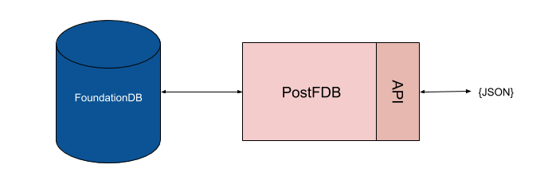

# PostFDB

*PostDB* is proof-of-concept database that exposes a Apache CouchDB-like API but which is backed by a FoundationDB database. It supports:

- Create/Delete database API
- Insert/Update/Delete document API, without requiring revision tokens.
- Bulk Insert/Update/Delete API.
- Fetch all documents or a range using the primary index.

It does not implement CouchDB's MVCC, Design Documents, attachments, MapReduce, "Mango" search or any other CouchDB feature.

It does however provide a "consistent" data store where the documents and secondary indexes are in lock-step. Documents are limited to 100KB in size.



## Running locally

Download this project and install the dependencies to run it on your machine:

```sh
npm install
npm run start
```

The application will connect to local FoundationDB instance and start serving out its API on port 5984 (CouchDB's default port), by default.

## API Reference

### Create Database - PUT /db

```sh
$ curl -X PUT http://localhost:5984/mydb
{ok:true}
```

### Get Database Info  - GET /db

```sh
$ curl -X GET http://localhost:5984/mydb
{"db_name":"mydb","instance_start_time":"0","doc_count":"0","sizes":{"file":"40960","active":"0"}
```

### Add a document (known ID) - PUT /db/id

```sh
$ curl -X PUT \
       -H 'Content-type: application/json' \
       -d '{"x": 1, "y": false, "z": "aardvark"}' \
       http://localhost:5984/mydb/a
{"ok":true,"id":"a","rev":"0-1"}
```

### Add a document (generated ID) - POST /db

```sh
$ curl -X POST \
       -H 'Content-type: application/json' \
       -d '{"x": 2, "y": true, "z": "bear"}' \
       http://localhost:5984/mydb
{"ok":true,"id":"001hla5z2pEedb3wB5rI2Rkd0k2pzUQg","rev":"0-1"}
```

### Get a document by id - GET /db/id

```sh
$ curl -X GET http://localhost:5984/mydb/a
{"x":1,"y":false,"z":"aardvark","_id":"a","_rev":"0-1","_i1":"","_i2":"","_i3":""}
```

### Get all documents - GET /db/_all_docs

```sh
$ curl -X GET http://localhost:5984/mydb/_all_docs
{"rows":[{"id":"a","key":"a","value":{"rev":"0-1"}},{"id":"001hla5z2pEedb3wB5rI2Rkd0k2pzUQg","key":"001hla5z2pEedb3wB5rI2Rkd0k2pzUQg","value":{"rev":"0-1"}},{"id":"b","key":"b","value":{"rev":"0-1"}},{"id":"c","key":"c","value":{"rev":"0-1"}},{"id":"d","key":"d","value":{"rev":"0-1"}},{"id":"e","key":"e","value":{"rev":"0-1"}},{"id":"f","key":"f","value":{"rev":"0-1"}}]}
```

Add `include_docs=true` to include document bodies:

```sh
$ curl -X GET http://localhost:5984/mydb/_all_docs?include_docs=true
{"rows":[{"id":"a","key":"a","value":{"rev":"0-1"},"doc":{"x":1,"y":false,"z":"aardvark","_id":"a","_rev":"0-1","_i1":"","_i2":"","_i3":""}},{"id":"001hla5z2pEedb3wB5rI2Rkd0k2pzUQg","key":"001hla5z2pEedb3wB5rI2Rkd0k2pzUQg","value":{"rev":"0-1"},"doc":{"x":2,"y":true,"z":"bear","_id":"001hla5z2pEedb3wB5rI2Rkd0k2pzUQg","_rev":"0-1","_i1":"","_i2":"","_i3":""}},{"id":"b","key":"b","value":{"rev":"0-1"},"doc":{"x":1,"y":false,"z":"bat","_id":"b","_rev":"0-1","_i1":"","_i2":"","_i3":""}},{"id":"c","key":"c","value":{"rev":"0-1"},"doc":{"x":1,"y":false,"z":"cat","_id":"c","_rev":"0-1","_i1":"","_i2":"","_i3":""}},{"id":"d","key":"d","value":{"rev":"0-1"},"doc":{"x":1,"y":false,"z":"dog","_id":"d","_rev":"0-1","_i1":"","_i2":"","_i3":""}},{"id":"e","key":"e","value":{"rev":"0-1"},"doc":{"x":1,"y":false,"z":"eagle","_id":"e","_rev":"0-1","_i1":"","_i2":"","_i3":""}},{"id":"f","key":"f","value":{"rev":"0-1"},"doc":{"x":1,"y":false,"z":"fox","_id":"f","_rev":"0-1","_i1":"","_i2":"","_i3":""}}]}
```

Add a `limit` parameter to reduce number of rows returned:

```sh
$ curl -X GET http://localhost:5984/mydb/_all_docs?limit=2
{"rows":[{"id":"a","key":"a","value":{"rev":"0-1"}},{"id":"001hla5z2pEedb3wB5rI2Rkd0k2pzUQg","key":"001hla5z2pEedb3wB5rI2Rkd0k2pzUQg","value":{"rev":"0-1"}}]}
```

Add an `offset` parameter to paginate into a result set:

```sh
$ curl -X GET 'http://localhost:5984/mydb/_all_docs?limit=100&offset=2000'
...
```

Use `startkey`/`endkey` to fetch a range of document ids:

```sh
$ curl -X GET 'http://localhost:5984/mydb/_all_docs?startkey="b"&endkey="d"'
{"rows":[{"id":"b","key":"b","value":{"rev":"0-1"}},{"id":"c","key":"c","value":{"rev":"0-1"}},{"id":"d","key":"d","value":{"rev":"0-1"}}]}
```

Parameters:

- `startkey`/`endkey` - one or both supplied, for range queries.
- `limit` - the number of documents to return   (default: 100)
- `offset` - the offset into the result set (default: 0)

### Get changes feed - GET /db/_changes

```sh
$ curl -X GET http://localhost:5984/mydb/_changes_
{"last_seq":"001hluy4","results":[{"changes":[{"rev":"0-1"}],"id":"001hluy43gHHub3XakCv0Mt4DL0LpMRr","seq":"001hluy4"},{"changes":[{"rev":"0-1"}],"id":"001hluy41gCxKV2lM6oV1eaRTp2apBWS","seq":"001hluy4"}}
```

Parameters:

- `since` - return changes after a known point. Default `0`
- `include_docs` - if `true` returns document body too. Default `false`
- `limit` - the number of documents to return.

### Bulk operations - POST /db/_bulk_docs

```sh
$ curl -X POST \
       -H 'Content-type: application/json' \
       -d '{"docs":[{"x": 2, "y": true, "z": "bear"},{"_id":"abc","_deleted":true}]}' \
       http://localhost:5984/mydb/_bulk_docs
[{"ok":true,"id":"001hlstC1aW4vf189ZLf2xZ9Rq4LriwV","rev":"0-1"},{"ok":true,"id":"abc","rev":"0-1"}]
```

### Delete a document - DELETE /db/id

```sh
$ curl -X DELETE http://localhost:5984/mydb/001hla5z2pEedb3wB5rI2Rkd0k2pzUQg
{"ok":true,"id":"001hla5z2pEedb3wB5rI2Rkd0k2pzUQg","rev":"0-1"}
```

### Purge a document - DELETE /db/id

Totally purge it from the database and changes feed.

```sh
$ curl -X POST \
       -d  '{"ga":[],"9Y":[]}' \
       http://localhost:5984/mydb/_purge_

{"purge_seq":null,"purged":{"ga":[],"9Y":[]}}
```

### Delete a database - DELETE /db

```sh
$ curl -X DELETE http://localhost:5984/mydb
{"ok":true}
```

## Dashboard

This project doesn't come with a dashboard but you can run *PostDB* and Apache CouchDB's [Fauxton](https://github.com/apache/couchdb-fauxton) dashboard alongside:

```sh
npm install -g fauxton
fauxton
```

The dashboard works for most things except Mango search.

## Configuring

The application is configured using environment variables

- `PORT` - the port that the database's web server will listen on. Default 5984.
- `READONLY` - set this to only allow read-only operations. Write operations will receive a 403 response. This is handy for configuring some nodes to point to PostgreSQL read replicas.
- `USERNAME`/`PASSWORD` - to insist on authenticated connections, both `USERNAME`/`PASSWORD` must be set and then the server will require them to be supplied in every request using HTTP Basic Authentication.
- `DEBUG` - when set to `postdb` the PostDB console will contain extra debugging information.
- `LOGGING` - the logging format. One of `combined`/`common`/`dev`/`short`/`tiny`/`none`. Default `dev`.

## Debugging

See debugging messages by setting the `DEBUG` environment variable:

```sh
DEBUG=postdb npm run start
```
